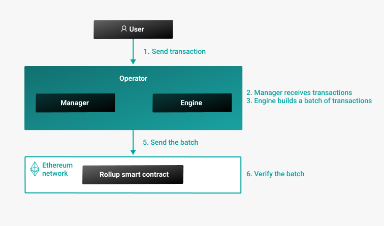

# Sumo rollup framework

## What is Sumo?

Sumo is a framework for implementing multiple types of rollups for the Ethereum
blockchain. Rollups are layer 2 scaling solutions that improve the scalability of Ethereum
networks by performing mass transaction validation off-chain. Sumo supports any EVM-based protocol,
including Proof of Work (PoW) and Proof of Authority (PoA) protocols.

Sumo currently implements Consensus rollups. Support for two additional types of rollups
(ZK-Rollups and Optimistic Rollups) will be added later.

Sumo introduces a centralized actor called an Operator which consists of a Manager and Engine.
The operator receives and executes transactions, manages the state, and submits batch transactions
to the Ethereum network.

Blockchain nodes do not re-execute the transactions; they wait until the operators reach consensus.

## Why use Sumo?

Using Consensus rollups, Sumo provides approximate speeds of 10,000 transactions per second (TPS)
with 100 million accounts, on a private blockchain with immediate finality producing 1 block per
second.
