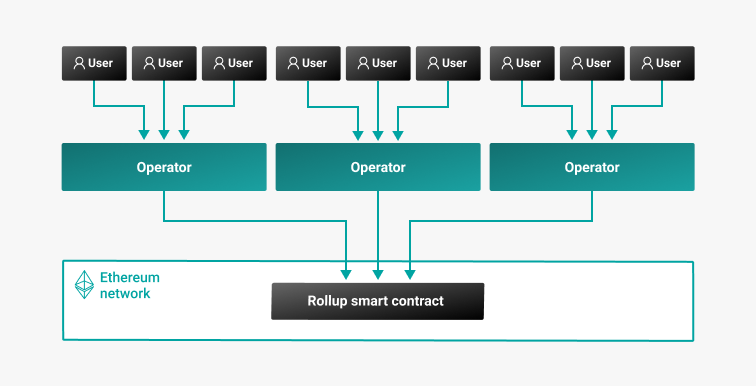

# ConsenSys Rollups

## What is ConsenSys Rollups?

ConsenSys Rollups is a framework for implementing [rollups](Concepts/Rollups/Overview.md) for the Ethereum blockchain.
Rollups are layer 2 scaling solutions that improve the scalability of Ethereum networks by performing mass transaction
validation offchain.

ConsenSys Rollups is an application-specific rollup with [partial anonymity](Concepts/Rollups/Partially-Anonymous-Rollups.md),
and is designed for private transfers at scale.

In the long term ConsenSys Rollups plans to add support for ZK-EVM programmable rollups.

ConsenSys Rollups introduces an actor called an operator which consists of a manager and engine.
The operator receives and executes transactions, manages the state, and submits batch transactions
to the Ethereum network. The blockchain nodes do not re-execute the transactions.

## Why use ConsenSys Rollups?

ConsenSys Rollups provides approximate speeds of 10,000 transactions per second (TPS)
with 100 million accounts, on a private blockchain with immediate finality producing 1 block per
second.
